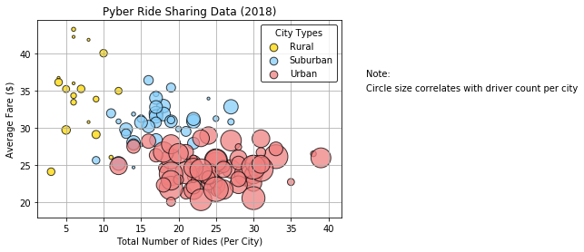
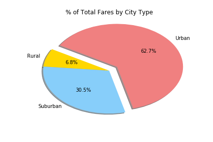
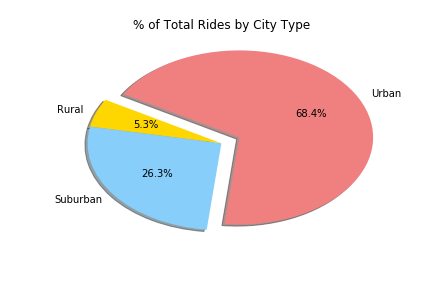
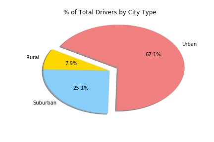

# Pyber_Rideshare
What good is data without a good plot to tell the story? The ride sharing bonanza continues! Seeing the success of notable players like Uber and Lyft, you've decided to join a fledgling ride sharing company of your own. In your latest capacity, you'll be acting as Chief Data Strategist for the company. In this role, you'll be expected to offer data-backed guidance on new opportunities for market differentiation.

The sample dataset represents the company's complete recordset of rides. This contains information about every active driver and historic ride, including details like city, driver count, individual fares, and city type.

The objective is to build bubble plots that showcase the relationship between four key variables:

* Average Fare ($) Per City
* Total Number of Rides Per City
* Total Number of Drivers Per City
* City Type (Urban, Suburban, Rural)

and to produce the following three pie charts:

* % of Total Fares by City Type
* % of Total Rides by City Type
* % of Total Drivers by City Type

Chief Data Strategist Analysis Report on Pyber Rideshare: We compared rideshare usage for cities classified as rural, suburban, and urban

Bubble plot of the different rider types, regions, and fares.

Pie charts for distribution of fares and riders by city type.

.

.
  

Libraries:
matplotlib.pyplot , pandas , numpy , os

Also Used:
Jupyter Notebook, Plots with aspects like: Plot Titles, Axes Labels, Legend Labels, Wedge Percentages, and Wedge Labels.
